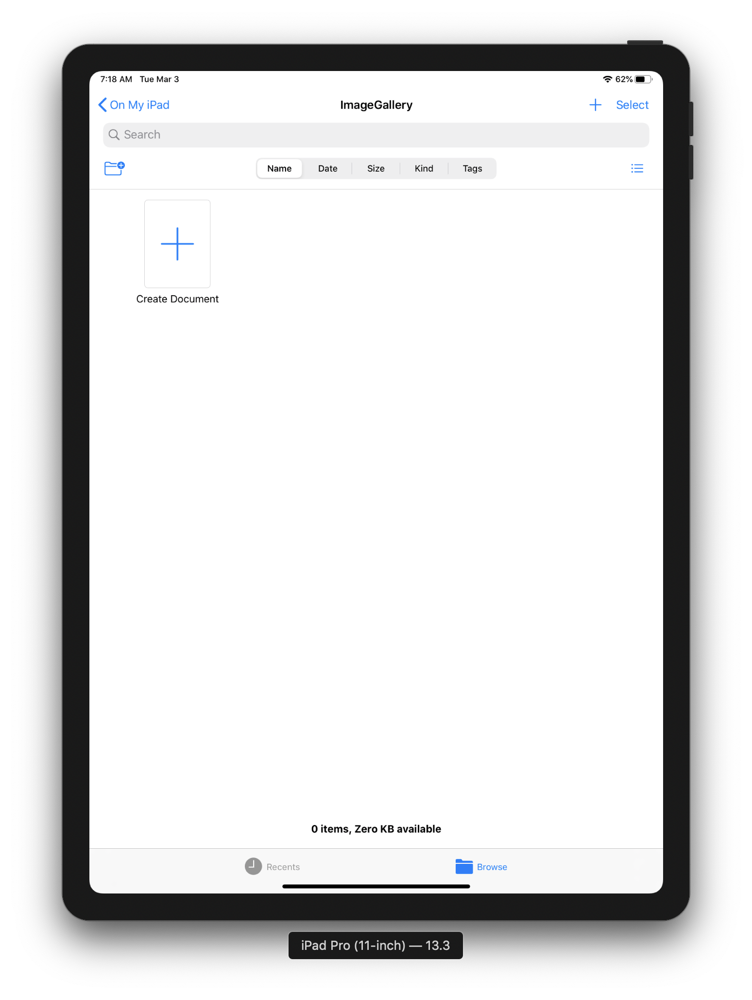
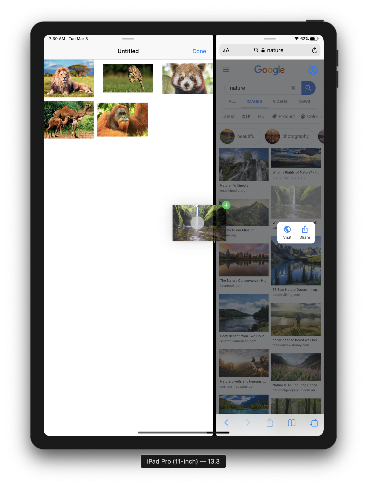
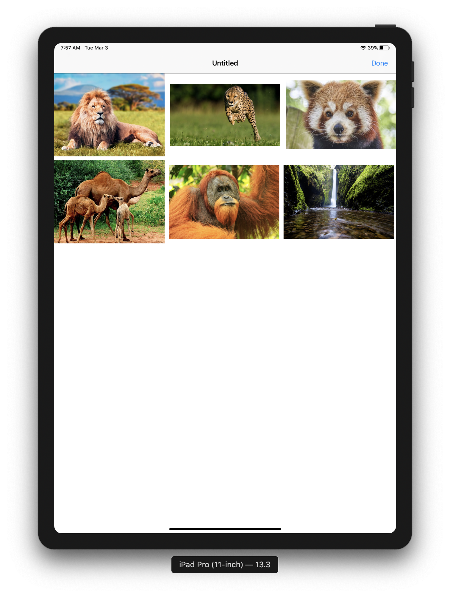
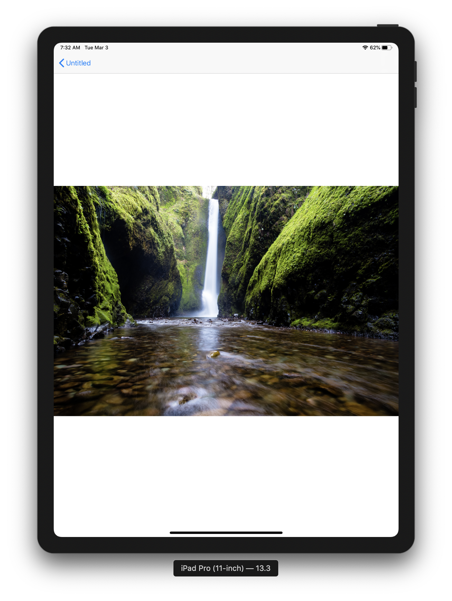
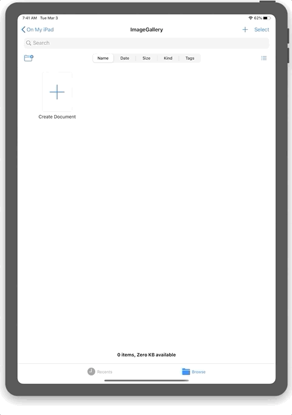

#  ImageGallery (Document-based)
ImageGallery is an iOS app for saving images using iOS' Drag and Drop feature.

> iOS allows iPad users to open multiple apps simultaneously. And you can drag and drop things from one app to another.

This is an iPad only app, where you can drag in images from other apps and save them into image galleries.  This app uses UIKit's ```UIDocument``` to store the image galleries as documents. And extending the use of Documents, this app uses UIKit's ```UIDocumentBrowserViewController```. It allows users to create, move, rename etc. the image galleries using the UI that is similar to the **Files** app.

One to note is that the other app (i.e. from which images are dragged) also needs to provide an image URL as well. Reason is, that ImageGallery only stores the image URL's and not the actual images in order to reduce it's memory footprint.

For testing purposes, new galleries are created with few sample images instead of being empty.

### App highlights
* Addition of images using iOS' Drag and Drop feature.
* Image gallery is implemented using```UICollectionView```.
* You can use *pinch to zoom* to resize image thumbnails. Implemented using Gesture recognisers.
* Images can be rearranged within a gallery. Also implemented using Drag and Drop.
* Clicking on image thumbnails in the gallery opens the image in fullscreen view.
* Fullscreen image view is a ```UIScrollView```.  You can use *pinch to zoom* to zoom-in and then pan around to view the image.
    * **Special Feature** - The scroll view is ***self-centering*** and always keeps itself at the center of the screen.
* Use of ```UIDocument``` to store an image gallery.
* Use of ```UIDocumentBrowserViewController``` to provide the UI for managing the image galleries.
* When new images are added, the processing is done in background asynchronously to fetch the images. User is shown the Activity Indicators till the loading is complete.

## Screenshots
App start view|Add images by Drag & Drop
---|---
|

Gallery View|Fullscreen View
---|---
|

#### GIFs
###### NOTE: GIFs are large in size, so it may take a little while for them to load
Create gallery & pinch to zoom gesture|Addition of images using Drag & Drop
---|---
|

Rearrange images by Drag & Drop|Fullscreen view, pinch to zoom & pan
---|---
|

## Project Status
This was the one of the first projects that I made when learning iOS Development.
There are still quite a few rough edges and finishing touches to be done.

